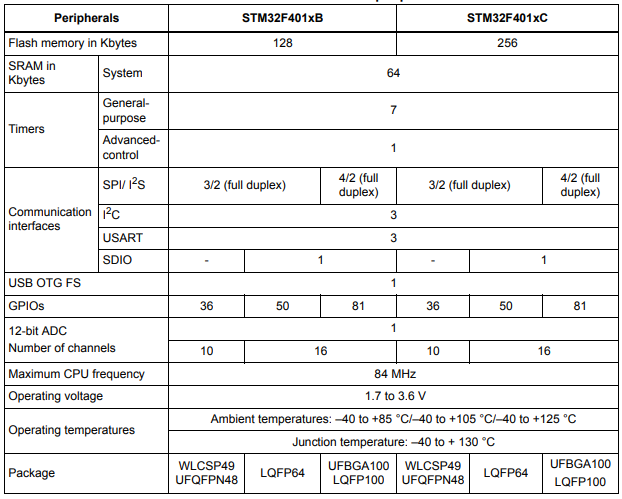

# [STM32F401](https://github.com/SoCXin/STM32F401)

* [ST](https://www.st.com/zh/)：[Cortex-M4](https://github.com/SoCXin/Cortex)
* [L4R4](https://github.com/SoCXin/Level) ：84 MHz * 1.25 DMIPS/MHz(285CoreMark)

## [简介](https://github.com/SoCXin/STM32F401/wiki)

[STM32F401](https://github.com/SoCXin/STM32F401) 系列属于STM32F4基本型，尺寸最小成本最低的解决方案，具有卓越的动态功耗效率。该系列产品采用意法半导体90 nm工艺和ART加速器，具有动态功耗调整功能，能够在运行模式和从Flash存储器执行时实现低至128 µA/MHz的电流消耗。 停机模式下，功耗低至9 µA。

动态功耗效率和批采集模式（BAM），一种新型面向数据批处理的利用DMA智能优化功耗的模式。STM32F4基本型具有84MHz/105DMIPS的处理速度，提供了最小型、高性价比的解决方案，具有出色的功率效率（Dynamic Efficiency™），并扩大了温度范围（高达125 °C的环境温度）。

### 关键特性

* 3路USART，速度高达10.5 Mbit/s
* 4路SPI，速度高达42 Mbit/s
* 2.4MSPS的12位ADC
* USB 2.0 OTG/FS Device
* SDIO
* 2.4MSPS的12位ADC
* 2个全双工I²S，最高32-bit/192KHz

#### 封装规格

* UFQFPN49
* LQFP64/100

### [资源收录](https://github.com/SoCXin)

* [参考文档](docs/)
* [参考资源](src/)
* [参考工程](project/)

### [选型建议](https://github.com/SoCXin)

[STM32F401](https://github.com/SoCXin/STM32F401)

### [探索芯世界 www.SoC.xin](http://www.SoC.Xin)
